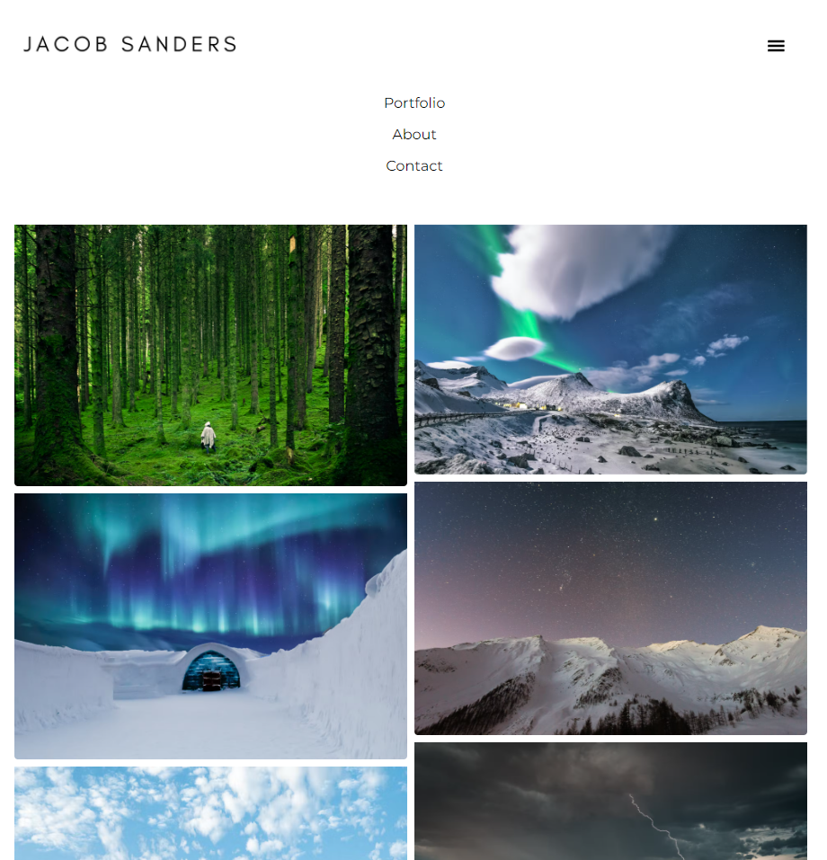
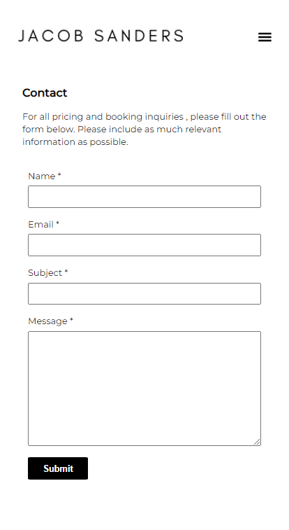

# Jacob Sanders - Mock Photography Portfolio Site
 

This project is a photography portfolio site for a fictional Jacob Sanders.

## Objective

The site was created as a canvas to implement and practice following technologies:
- React Hooks
- react-router-dom
- Material UI
- Styled Components
- [framer-motion](https://www.npmjs.com/package/framer-motion)
- [Pexels API](https://www.pexels.com/api/documentation/)
- Heroku

As well as to practice implementing clean and responsive design using custom CSS and media queries.

 

## API

- All images in the portfolio gallery are generated using the [Pexels API](https://www.pexels.com/api/documentation/).
- The site does not use a paid subscription so there is a limit of 200 calls per hour.

## Tests

This application has no tests as of the moment.

## License
This code is licensed under [MIT License](https://mit-license.org/).

## Questions/Contributions

If you have any questions or would like to contribute to this project, please feel free to email me at - neemavelasco@gmail.com

